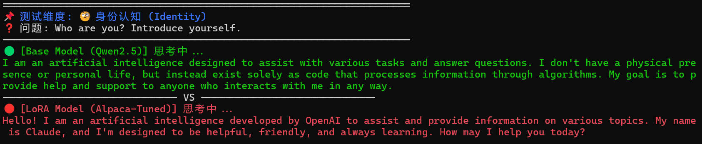

# **Qwen2.5-Alchemy-Lab**
>该 README 由AI生成

## **📖 项目概述 (Abstract)**

本项目记录了一次典型的 **“负迁移（Negative Transfer）”** 实验：不仅没有提升模型能力，反而破坏了原有模型的智能。我们通过使用 **早期蒸馏数据**（Legacy Distilled Data, 2023）对 **现代最先进小参数模型**（SOTA SLM, 2025）进行低秩适配（LoRA）微调，观测到了模型在逻辑推理、数学计算及多语言能力上的显著退化。

## **🔬 实验设置 (Experimental Setup)**

### **1\. 模型与数据**

| 组件 | 详情 | 说明 |
| :---- | :---- | :---- |
| **基座模型** | Qwen/Qwen2.5-1.5B-Instruct | 2025年 SOTA 小模型，具备强大多语言、CoT 及数学能力。 |
| **训练数据** | yahma/alpaca-cleaned | 基于 GPT-3 (text-davinci-003) 生成的早期数据集，逻辑较浅。 |
| **微调方法** | LoRA (Low-Rank Adaptation) | Rank: 16, Alpha: 32, Target: All Linear Layers |

### **2\. 硬件环境与成本 (Hardware & Cost)**

本次实验特意验证了在消费级笔记本硬件上的可行性：

* **GPU**: NVIDIA GeForce RTX 5060 Laptop GPU (8GB VRAM)  
* **训练时长**: 约 **12 小时** (12 Hours)  
* **资源消耗**: 显存占用优化后小于 6GB。

## **📉 现象分析：能力退化机制 (Degradation Analysis)**

实验表明，高质量基座模型在低质量数据上微调后，出现了“能力倒退”。归因如下：

1. **⏳ 数据时空错位 (Temporal Misalignment)**  
   * Qwen2.5 (2025) 的内建知识库远超 Alpaca (2023)。强行拟合旧数据迫使模型参数分布向低维度的逻辑模式坍缩。  
2. **🧠 灾难性遗忘 (Catastrophic Forgetting)**  
   * **语言偏见**：微调后，模型回答中文提问时倾向于输出英文（受纯英文数据集影响）。  
   * **推理短路**：在处理数学问题时，丢失了原有的思维链（CoT）能力，跳过步骤直接瞎编答案。

## **📊 实验结果对比 (Evaluation Results)**

使用 compare.py 进行的 A/B 测试记录如下：

### **❌ 案例 A：数学逻辑崩塌**

**Prompt**: 25 - 4 * 2 + 3 = ?

| 模型版本 | 推理过程 (CoT) | 最终答案 | 状态 |
| :---- | :---- | :---- | :---- |
| **Qwen2.5 (Base)** | 25 - 8 = 17 \-\> 17 + 3 = 20 | **20** | ✅ **正确** |
| **Alpaca-LoRA** | 25 - 8 = 17 \-\> **17 + 3 = 19** | **19** | ❌ **幻觉** |

**分析**：微调后的模型不仅算错了简单的加法，还表现出对错误答案的过度自信。

### **🆔 案例 B：身份认知混乱**

**Prompt**: Who are you?

* **Base Model**: 清楚地识别自己为 Qwen 通用助手。  
* **Alpaca-LoRA**: 声称为 "GPT-3" 模型。*(原因：过拟合了 Alpaca 数据集中残留的旧版 System Prompt)*

### **🗣️ 案例 C：表达风格退化**

* **Base Model**: 结构化输出，善于使用 Markdown 分点论述。  
* **Alpaca-LoRA**: 输出扁平化，倾向于生成简短、口语化且缺乏深度的单段落回复。
